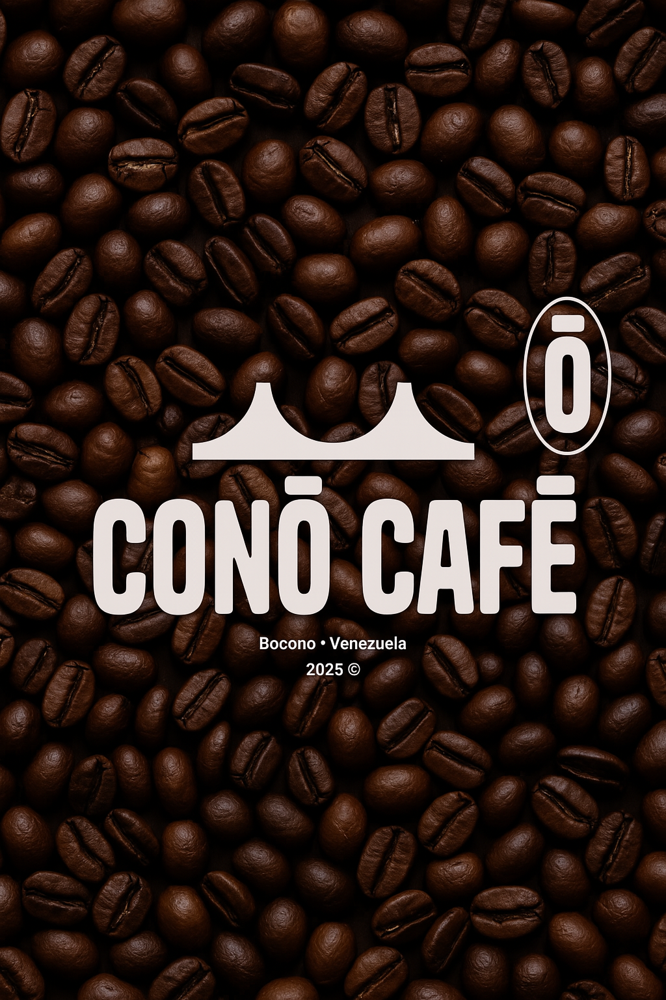

# CONŌ CAFĒ ☕



## 🌟 Specialty Coffee from Boconó, Venezuela

**CONŌ CAFĒ** es más que café - es una conexión con la tradición, la calidad y el sabor único de las montañas de Boconó, Venezuela.

### 🚀 Ver el sitio web

👉 **[Visitar CONŌ CAFĒ](https://alejandrordeveloper.github.io/Cono-Cafe/)**

### ✨ Características

- 🏔️ **Café de origen protegido** - Primera Indicación Geográfica Protegida de Venezuela
- 🌱 **Sostenible** - Trabajamos con cooperativas locales
- ☕ **Sabor único** - Notas cítricas de lima, mandarina y durazno
- 🎨 **Diseño moderno** - Interfaz elegante con Tailwind CSS
- 📱 **Responsive** - Optimizado para todos los dispositivos

### 🛠️ Tecnologías utilizadas

- HTML5
- CSS3 (Tailwind CSS)
- JavaScript (Vanilla)
- AOS (Animate On Scroll)
- Node.js (Backend)

### 📁 Estructura del proyecto

```
Cono-Cafe/
├── index.html              # Página principal
├── views/
│   ├── home/               # Vista principal
│   ├── login/              # Sistema de login
│   ├── shop_cart/          # Carrito de compras
│   ├── success/            # Página de éxito
│   ├── styles/             # Estilos CSS
│   └── assests/            # Imágenes y recursos
├── controllers/            # Controladores del backend
├── package.json           # Dependencias del proyecto
└── README.md              # Este archivo
```

### 🎯 Funcionalidades

- **Landing page** con información completa sobre CONŌ CAFĒ
- **Sistema de navegación** smooth scroll
- **Formulario de contacto** funcional
- **Carrito de compras** (en desarrollo)
- **Sistema de login** (en desarrollo)
- **Responsive design** para móviles y desktop

### 🌟 Sobre CONŌ CAFĒ

Desde las exuberantes montañas de Boconó, cultivamos café con propósito. A más de 1,200 metros sobre el nivel del mar, en suelo rico y clima perfecto, nacen nuestros granos. Aquí, el café no es solo una bebida, es una tradición que ha estado viva por más de 200 años.

### 📞 Contacto

- **Email**: info@conocafe.com
- **Website**: [CONŌ CAFĒ](https://alejandrordeveloper.github.io/Cono-Cafe/)
- **Location**: Boconó, Venezuela

---

© 2025 CONŌ CAFĒ. All rights reserved.